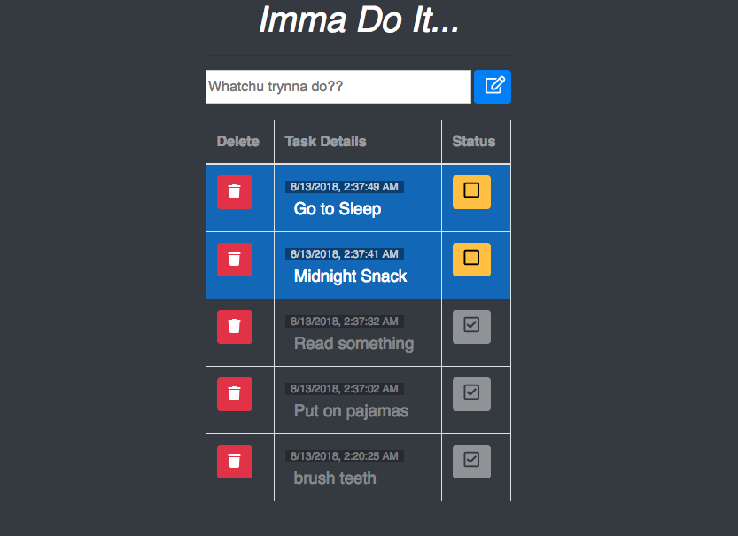

# 'Imma Do It...
##### A mobile-first app task managment.
Play with the live version here: https://peaceful-ridge-80734.herokuapp.com/
---
## Technology
1. MongoDB
2. Express
3. Angular.js
4. Node.js
4. Sweet Alerts
5. Heroku

## Basic Objectives
1. [x] Create a front end experience that allows a user to create a task.
2. [x] Store task inside of a database (MongoDB)
3. [x] When a task is created the front end should refresh to show all tasks that need to be completed
4. [x] Each task should have an option to 'Complete' and 'Delete'
5. [x] When a task is complete, it should change colors
6. [x] Whether or not a task is complete should also be stored in the database
7. [x] Deleting a task should remove it both from the Front End as well as the Database

## Styling Objectives
1. [x] Background color for page
2. [x] Adjust font family & size
3. [x] text color and/or background color of tasks to show completion

## Stretch Goals
1. [x] Implement Bootstrap
2. [x] Implement Sweet Alert for deletion buttion.
3. [x] Move the inputs into a form &  allow user to hit enter to add a new task.
4. [x] Add front-end validation to the 'make-a-task' form.
5. [ ] Add a category field for the task. Allow users to filter by task category.
6. [X] Adjust the logic so that completed tasks are brought to the bottom of the page, where the remaining tasks left to complete are brought to the top of the list.

## Screenshot

## Next Steps
Need to add categories for tasks & filter feature for sorting tasks by category.

## Author
Jakeh Clark

