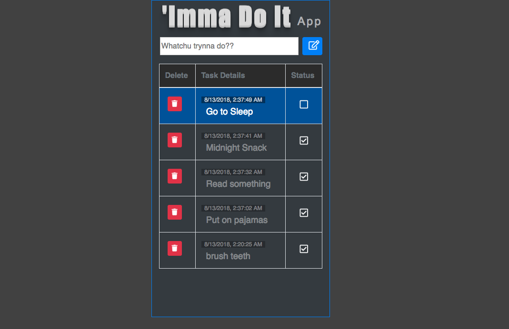

# Imma Do It...
### A simple 'To-Do' app using Mongo, Express, Angular, and Node.
---

## Basic Objectives
1. [x] Using AngularJS, create a front end experience that allows a user to create a task.
2. [x] When the task is created, it should be stored inside of a database (MongoDB)
3. [x] Whenever a task is created the front end should refresh to show all tasks that need to be completed.
4. [x] Each task should have an option to 'Complete' or 'Delete'.
5. [x] When a task is complete, its visual representation should change on the front end (for example, the background of the task container could change from gray to green, as well as the complete option 'checked off'. Each of these are accomplished in CSS, but will need to hook into logic to know whether or not the task is complete. ng-class will come in handy!)
6. [x] Whether or not a task is complete should also be stored in the database.
7. [x] Deleting a task should remove it both from the Front End as well as the Database.
8. [X] Include a README.md in project (template).

## Styling Objectives
1. [x] Background color for page
2. [x] Adjust font family & size
3. [x] text color and/or background color of tasks to show whether or not they have been completed

## Stretch Goals
1. [x] Implement Bootstrap to take the visuals of the page up a notch.
2. [x] In whatever fashion you would like, create an 'are you sure: yes / no' option when deleting a task. Once again, you can interpret this however you would like.
3. [x] Move the inputs into a form and use ng-submit so that the user can hit enter to add a new task.
4. [x] Add front-end validation to the 'make-a-task' form.
5. [ ] Add a category field for the task. Allow users to filter by task category.
6. [X] Adjust the logic so that completed tasks are brought to the bottom of the page, where the remaining tasks left to complete are brought to the top of the list.

## Screenshot

## Next Steps
Need to add categories for tasks & filter feature for sorting tasks by category.

## Author
Jakeh Clark

